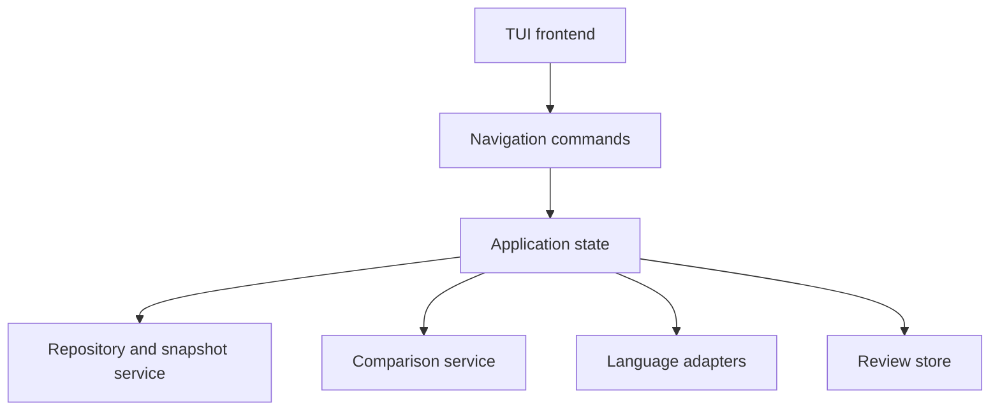

# Temporal Code Explorer

## Design document for a unified code exploration and patch review tool

**Status:** Initial design  
**Target:** TUI-first prototype with a frontend-independent core  
**Primary use cases:** Repository exploration, history exploration, patch review, and semantic code navigation

## 1. Summary

Temporal Code Explorer is a repository browser in which source code, history, and change are different views of the same underlying object.

Most existing tools make either repository **state** or repository **change** primary:

- Editors and IDEs show the source tree and current files, with history added as a secondary feature.
- Diff and review tools show a patch, with access to the surrounding repository added as a secondary feature.
- History viewers show commits, with snapshots and diffs attached to the selected commit.

This tool instead presents the repository at a selected point in history and overlays a selected comparison on that snapshot. The user can move continuously between ordinary code browsing and focused patch review without changing modes or losing their location.

The central model consists of four concepts:

- **Snapshot:** The repository state being inspected, such as a commit, branch head, index, or working tree.
- **Comparison:** The change from a base state to a target state, such as `parent(C) -> C`, `merge-base -> branch-head`, or `HEAD -> worktree`.
- **Scope:** The repository element currently in focus: repository, directory, file, symbol, reference, selection, or line.
- **Lens:** Information overlaid on the snapshot, such as change, history, semantic relationships, blame, diagnostics, or review state.

An example application state is:

> Snapshot `feature-head`; comparison `merge-base -> feature-head`; scope `Parser.Parse`; lenses `change + references + review`.

The recommended first implementation is a keyboard-oriented TUI. The repository, comparison, navigation, and semantic models should remain independent of the TUI so that a GUI can later reuse them.

## 2. Product goals

### 2.1 Primary goals

1. **Preserve context during review.** A reviewer should be able to inspect unchanged definitions, callers, tests, and neighboring files without leaving the review or losing the current changed location.
2. **Make state and change equally accessible.** The same file view should support plain reading, light change decoration, and full before/after inspection.
3. **Support bidirectional exploration.** Selecting history should update the tree and source; selecting a file or symbol should constrain or annotate history.
4. **Treat semantic units as first-class navigation targets.** Functions, types, declarations, calls, reads, writes, and tests should eventually complement files, lines, and hunks.
5. **Make arbitrary comparisons ordinary.** Inspecting one commit, reviewing a branch, and comparing two releases should use the same interaction model.
6. **Remain useful before semantic analysis exists.** A Git- and text-based MVP must already provide a coherent product.

### 2.2 Non-goals for the first version

- Editing source code.
- Replacing a complete IDE or language server client.
- Hosting pull-request discussions or synchronizing with every forge.
- Perfectly tracking symbol identity through arbitrary refactorings.
- Producing an automatic natural-language explanation of a patch.
- Supporting every Git edge case in the initial prototype.

The first version is deliberately read-only. This permits stronger navigation invariants, simpler snapshot caching, and fewer conflicts between the displayed repository state and mutable files.

## 3. Core conceptual model

### 3.1 Snapshot

A snapshot is the complete repository state shown to the user. It may be:

- a commit;
- a symbolic reference such as `main` or `HEAD`;
- the index;
- the working tree;
- a synthetic state supplied by a code review system.

The source pane always renders content from the active snapshot. This is a crucial invariant: changing the comparison changes annotations, not the underlying meaning of the displayed file.

For deleted files, the tool may temporarily use the comparison base as the displayed side, clearly labeling it as a base-only file.

### 3.2 Comparison

A comparison is an ordered pair `A -> B`. It determines which paths, lines, and eventually semantic entities are considered changed.

Common presets are:

| User operation | Snapshot | Comparison |
| --- | --- | --- |
| Inspect commit `C` | `C` | `parent(C) -> C` |
| Browse without change | selected state | none |
| Inspect working changes | working tree | `HEAD -> worktree` |
| Inspect staged changes | index | `HEAD -> index` |
| Review a branch or PR | branch head | `merge-base -> branch-head` |
| Compare releases | newer release | `older release -> newer release` |

The comparison target will normally equal the snapshot, but the model should not require this. A future use case may show the current source while annotating lines last changed in an older comparison.

### 3.3 Scope

Scope says which part of the repository drives filtering and navigation:

```text
repository
  directory
    file
      symbol
        reference or call
          source range
```

Scope is not merely the selected row in a pane. It is an explicit part of application state and may be pinned while another dimension changes.

Examples:

- Pin a file, then move through commits that changed it.
- Pin a symbol, then inspect how it evolved.
- Pin a comparison, then browse every affected directory and file.
- Pin a commit, then explore arbitrary unchanged code in its snapshot.

### 3.4 Lens

A lens projects additional information onto the active snapshot and scope.

Initial lenses:

- **Change:** Added, deleted, and modified lines and files.
- **History:** Commits relevant to the current scope.
- **Structure:** File outline and changed declarations.

Later lenses:

- semantic references and call relationships;
- blame and origin;
- diagnostics and proof results;
- review state and discussions;
- test relationships;
- unexplained or mechanically classified changes.

Lenses should compose. Selecting the change and diagnostics lenses together should show diagnostics in the source snapshot while indicating whether each diagnostic lies in changed code.

## 4. Interaction model

### 4.1 Persistent panes

The initial TUI uses three main panes:

```text
+------------------+--------------------------+------------------------------------+
| HISTORY          | TREE / CHANGE OUTLINE    | SOURCE                             |
|                  |                          |                                    |
| a81c Fix parser  | src/                     | procedure Parse (...) is           |
| 18ea Refactor    |   parser/                |    New_State : State;              |
| 902b Add tests   |     parser.adb       M   | >  New_State := Initialize;        |
|                  |     tokens.ads       M   |    ...                             |
|                  | tests/                   |                                    |
|                  |   parser_tests.adb   M   |                                    |
+------------------+--------------------------+------------------------------------+
| snapshot: a81c  comparison: 18ea -> a81c  scope: parser.adb  lens: changed lines |
+----------------------------------------------------------------------------------+
```

The exact layout may adapt to terminal width. On narrow terminals, the history and tree panes may share a switchable sidebar, but they remain separate concepts.

### 4.2 Cross-filtering

Selections in each pane affect the others:

| Selection | History effect | Tree effect | Source effect |
| --- | --- | --- | --- |
| Commit | Selects or derives comparison | Marks changed paths | Shows selected snapshot and change |
| File | Emphasizes or filters touching commits | Selects path | Opens file at snapshot |
| Symbol | Shows commits touching symbol | Highlights containing path | Selects declaration/range |
| Changed line | Shows origin and related commits | Keeps containing path selected | Focuses line and nearby hunk |
| Two revisions | Defines comparison | Marks paths changed between them | Shows change overlay at target |

Filtering should normally be explicit. Merely moving the cursor over a file may emphasize related history entries; a command such as **filter history to scope** applies the persistent filter. This prevents the interface from changing too aggressively during navigation.

### 4.3 Pinning

Any scope that has a stable identity can be pinned. A pinned scope survives changes to the selected commit or comparison where possible.

Examples:

- Pin `src/parser/parser.adb`, then traverse only commits that changed the file.
- Pin `Parser.Parse`, then inspect its versions across time.
- Pin `src/semantic`, then compare its aggregate change across releases.

If the pinned entity does not exist in the selected snapshot, the UI should retain the pin and show a reason such as “not yet introduced,” “deleted,” or “identity uncertain.” It should not silently select an unrelated nearby entity.

### 4.4 Navigation stack

Following a definition, call, reference, history entry, or changed entity pushes the current location onto a navigation stack. Back and forward commands restore the complete navigational location:

- snapshot;
- comparison;
- scope;
- selected pane item;
- source cursor and scroll position;
- active filters and lenses.

This is more important than preserving only file and line: semantic exploration often temporarily changes both scope and snapshot.

## 5. Representing change inside a file

The source pane should remain the primary representation. A user cycles through increasing strengths of the change lens:

1. **None:** Plain file content at the snapshot.
2. **Gutter:** Change markers and optional line coloring, with the full file visible.
3. **Changed lines:** Full file remains navigable, while changed ranges receive strong emphasis and unchanged text is subdued.
4. **Hunks:** Only change regions and configured context are shown.
5. **Before/after:** A conventional unified or side-by-side diff.

The first three are the distinctive part of the design. They let a user review a change while retaining the structural and spatial context of the target file.

Deleted lines do not exist in the target snapshot. The tool should support two complementary representations:

- an inline ghost block anchored at the deletion point; and
- a temporary before/after view for ambiguous or large replacements.

Ghost blocks must be visually unmistakable as content from the comparison base, not part of the snapshot.

### 5.1 Change navigation

The tool should distinguish several “next” operations:

- next changed line;
- next hunk;
- next changed symbol;
- next changed file;
- next unreviewed semantic unit, once review state exists.

These operations should not be collapsed into a single next-change command because they serve different review rhythms.

## 6. Repository tree and change outline

The ordinary directory tree retains its canonical ordering. Modified files should not simply be sorted to the top, because that destroys spatial memory and hides their architectural location.

Instead, the tree supports three visibility modes:

- **All files:** Complete snapshot tree, with change badges.
- **Changed and ancestors:** Changed paths plus the directory structure needed to locate them.
- **Changed only:** A flat or grouped patch-oriented list.

The default review mode should be **changed and ancestors**.

A complementary change outline groups modifications by structural unit:

```text
4 files changed

parser.adb
  Parse                         modified
  Recover_From_Error            modified
tokens.ads
  Token_Kind                    modified
resolver.adb
  Candidate_Set                 added
parser_tests.adb
  Parse_Malformed_Input         added
```

The MVP may initially show hunks in place of symbols. Once structure is available, the same outline can progressively upgrade without changing the surrounding interface.

## 7. History

### 7.1 Commit selection

Selecting a commit normally sets:

```text
snapshot   = selected commit
comparison = first parent -> selected commit
```

Merge commits require an explicit policy. The initial default should compare with the first parent, with commands to select another parent or a combined view later.

### 7.2 Scoped history

History can be scoped to:

- repository;
- directory;
- file;
- symbol;
- selected source range.

File history can use Git path history in the MVP. Symbol history is harder: line-range history is an acceptable fallback, but the UI must describe it as approximate when stable semantic tracking is unavailable.

### 7.3 Entity-through-time view

When a file or symbol is pinned, the history pane should become a concise timeline of meaningful changes:

```text
C5  signature changed
C4  body modified
C3  error branch added
C2  renamed from Parse_Input     probable
C1  introduced
```

The tool should distinguish facts derived directly from Git or syntax from heuristic inferences such as probable renames.

## 8. Semantic exploration

Semantic capabilities should be layered rather than required by the core.

### 8.1 Capability levels

| Level | Available information | Possible implementation |
| --- | --- | --- |
| Text | Lines, hunks, paths, text search | Git plus text processing |
| Syntax | Declarations, structural ranges, changed entities | Tree-sitter or language parser |
| Project semantics | Definitions, references, calls, reads/writes | Language server or compiler analysis API |
| Domain semantics | Tests, proof obligations, diagnostics, effects | Language-specific adapters |

The interface queries capabilities rather than assuming all languages support every operation. Unsupported operations remain visibly unavailable instead of returning misleading partial results.

### 8.2 Semantic identity

A symbol identity should include more than a name. Depending on the language it may use:

- repository-relative path;
- qualified name;
- declaration kind;
- signature or profile;
- enclosing symbol chain;
- source fingerprint.

Tracking across snapshots can use a confidence-ranked strategy:

1. exact identity match;
2. language-aware rename or move information;
3. structural similarity within the same file;
4. structural similarity across renamed files;
5. line-based fallback.

The UI must surface uncertainty. A heuristic match must never be presented as a certain continuation of the same symbol.

### 8.3 Changed semantic units

Given a textual diff and syntax trees for both sides, the tool derives changed units by mapping changed ranges to the smallest useful enclosing declarations. This supports:

- a semantic change outline;
- next changed entity;
- history filtered to a declaration;
- review completion by declaration rather than hunk;
- grouping references according to whether they are themselves changed.

For Ada, an initial adapter could use Libadalang for parsing, declarations, references, and source locations. The core protocol should remain language-neutral.

## 9. Review model

Review is a lens over a comparison, not a separate application mode.

Potential review annotations include:

| Marker | Meaning |
| --- | --- |
| Changed | Part of the active comparison |
| Reviewed | Reviewer marked the unit complete |
| Discussion | Comment or unresolved thread exists |
| Diagnostic | Static analysis or proof result is attached |
| Unexplained | Change has not been classified or understood |

Review state should attach to durable anchors. Preferred anchors are semantic entities plus a content fingerprint; line ranges are a fallback. When the comparison changes, stale review marks should be detected rather than silently applied.

The local prototype may store review state in an application database keyed by repository identity and comparison. Integration with GitHub, GitLab, or another forge belongs in a later adapter.

## 10. Commands and keyboard interaction

Exact bindings should remain configurable, but an initial vocabulary may be:

| Command | Suggested key | Effect |
| --- | --- | --- |
| Focus history | `h` | Move input focus to history pane |
| Focus tree | `t` | Move input focus to tree/change outline |
| Focus source | `s` | Move input focus to source pane |
| Cycle change lens | `d` | None -> gutter -> changed lines -> hunks -> diff |
| Filter history to scope | `f` | Apply current scope to history |
| Clear filter | `F` | Return to repository history |
| Pin scope | `p` | Keep selected path/entity while history changes |
| Choose comparison | `c` | Open comparison selector |
| Next hunk | `]c` | Move to next textual change |
| Previous hunk | `[c` | Move to previous textual change |
| Next changed entity | `]e` | Move to next changed semantic unit |
| Follow | `Enter` | Open selected file, symbol, reference, or commit |
| Back | `Backspace` | Restore previous navigation state |
| Forward | configurable | Restore next navigation state |
| Command palette | `:` | Search all commands |

The status line should continuously expose snapshot, comparison, scope, active filter, and change-lens strength. Hidden state would otherwise make a cross-filtering interface confusing.

## 11. Architecture

The application should separate repository modeling from presentation.



### 11.1 Core services

**Repository service**

- resolves revisions and working-tree states;
- enumerates trees without requiring checkout;
- retrieves blobs and metadata;
- supplies commit graph and path history;
- detects renames when requested.

**Comparison service**

- computes path changes and textual hunks;
- maps base and target locations;
- supports working tree, index, commits, and merge bases;
- caches comparisons separately from rendered views.

**Semantic service**

- parses content from arbitrary snapshots;
- returns document symbols and structural ranges;
- resolves definitions and references when supported;
- maps textual changes to semantic units;
- reports capability and confidence metadata.

**Application state**

- owns snapshot, comparison, scope, lenses, filters, pins, and pane selection;
- records navigation-stack entries;
- applies commands as explicit state transitions;
- exposes observable results to any frontend.

**Review store**

- stores local review marks and annotations;
- validates anchors against comparison content;
- later synchronizes with forge-specific adapters.

### 11.2 Frontend-independent commands

The frontend should submit semantic commands such as:

```text
SelectSnapshot(commit)
SetComparison(base, target)
SelectScope(file_or_symbol)
SetHistoryFilter(scope)
PinScope(scope)
CycleChangeLens
Follow(target)
NavigateBack
```

Widgets must not directly mutate unrelated panes. A command updates central state, and every pane derives its view from that state. This makes cross-filtering behavior testable and reduces accidental mode-specific logic.

### 11.3 Git access

Prefer reading objects directly through a mature Git library where practical. Some operations may initially call the Git executable, especially complex revision selection, path history, and rename-aware log queries.

The design should hide this choice behind the repository service. The MVP can therefore use whichever approach gives the fastest reliable implementation without fixing the long-term backend.

### 11.4 Concurrency and responsiveness

Repository operations, semantic analysis, and diff computation can be expensive. The UI thread must never wait synchronously for them.

Every background result should be associated with the state revision that requested it. If the user navigates elsewhere before it completes, the result may populate a cache but must not overwrite the current view.

Priority order:

1. selected file content and visible decorations;
2. selected tree and history rows;
3. nearby changes for next/previous navigation;
4. semantic references and historical enrichment;
5. speculative prefetching.

## 12. Data model sketch

The following types are conceptual rather than language-specific:

```text
Revision = Commit(id) | SymbolicRef(name) | Index | Worktree

Snapshot {
    revision: Revision
}

Comparison {
    base: Revision
    target: Revision
    merge_policy: Optional<MergePolicy>
}

Scope = Repository
      | Directory(path)
      | File(path)
      | Symbol(symbol_id, location, confidence)
      | SourceRange(path, range)

LensSet {
    change_strength
    history
    structure
    semantics
    diagnostics
    review
    blame
}

ViewState {
    snapshot
    comparison
    scope
    pinned_scope
    lenses
    history_filter
    focus
    pane_positions
}
```

Snapshot-relative and comparison-relative data should be kept distinct. A symbol location belongs to a snapshot; a changed semantic entity belongs to a comparison and contains locations on zero, one, or both sides.

## 13. MVP definition

The MVP should validate the interaction model rather than maximize integrations.

### 13.1 Included

- Open a local Git repository.
- Show commit history with basic graph information.
- Select a commit and derive `parent -> commit` comparison.
- Select working tree mode and derive `HEAD -> worktree` comparison.
- Browse the full tree for a commit without checking it out.
- Toggle tree visibility among all, changed and ancestors, and changed only.
- Open any file at the selected snapshot.
- Show gutter, changed-lines, and hunk-focused representations.
- Render deleted lines as clearly marked inline ghost blocks.
- Navigate between hunks and changed files.
- Filter history to the selected file.
- Pin a file while moving through history.
- Preserve complete locations in back/forward navigation.
- Provide text search within the current file and repository snapshot.

### 13.2 Optional MVP extension

Add syntax-level structure for one language:

- file outline;
- mapping hunks to enclosing declarations;
- change outline by declaration;
- next changed declaration.

Ada is a reasonable first language for the intended user and can use Libadalang, but the protocol should make the adapter replaceable.

### 13.3 Explicitly deferred

- arbitrary merge-parent and combined diff UX;
- side-by-side diff;
- symbol tracking across renames;
- cross-snapshot semantic references;
- GitHub or GitLab comments;
- collaborative review state;
- editing;
- GUI frontend.

## 14. Implementation phases

### Phase 0: State-machine prototype

Build an intentionally plain interface around fake or small repository data. Validate:

- snapshot/comparison independence;
- pane cross-filtering;
- pin behavior;
- navigation-stack restoration;
- change-lens cycling.

The output is a tested application-state model, not polished widgets.

### Phase 1: Git-backed textual explorer

Implement commit history, arbitrary snapshot trees, blob display, textual comparisons, file-scoped history, and working-tree support. This phase should already be a useful daily tool.

### Phase 2: Syntax-aware change outline

Introduce the language-adapter protocol and one parser. Add structural outline, changed declaration mapping, and semantic-unit navigation.

### Phase 3: Semantic relationships

Add definitions, references, callers, callees, reads, writes, and tests where an adapter can provide them. Mark which related locations are touched by the active comparison.

### Phase 4: Review and diagnostics

Add local review completion, comments or notes, static-analysis annotations, and adapter hooks for forge synchronization.

### Phase 5: GUI evaluation

Evaluate a GUI only after the state model and core workflows are stable. A GUI would be justified by persistent multi-view layouts, visual commit graphs, side-by-side history, hover details, drag selection of revisions, and richer inline annotations—not merely by reproducing the TUI with mouse input.

## 15. Technical choices

### 15.1 TUI versus GUI

The TUI is recommended for the first implementation because:

- the principal operations are navigation and filtering;
- a three-pane keyboard workflow maps naturally to terminal use;
- it keeps the prototype focused on the novel state model;
- it fits existing terminal-heavy development workflows;
- it permits rapid iteration on commands and transitions.

The product should not be defined as permanently terminal-only. The boundary between core commands and frontend presentation is therefore a design requirement from the beginning.

### 15.2 Implementation language

Rust is the strongest default for a new implementation:

- mature TUI libraries;
- strong libraries for Git object access, parsing, async work, and caching;
- good control over latency and memory use;
- suitable abstractions for a frontend-independent core;
- a plausible path to both native TUI and GUI frontends.

Go remains viable for a quick Git-and-text prototype, but Rust is likely to fit the long-term combination of rich TUI behavior, syntax trees, language adapters, incremental background work, and possibly a native GUI.

Possible Rust components include a Git backend abstraction, a TUI frontend, a rope or indexed text representation, and optional Tree-sitter or language-specific adapters. Exact library selection should be made during implementation based on current maintenance and feature fit.

## 16. Testing strategy

The unusual behavior lies in state transitions, so tests should concentrate there.

### 16.1 Core model tests

- Selecting a commit derives the expected snapshot and comparison.
- Selecting a file changes scope without changing snapshot.
- Filtering history does not implicitly change comparison.
- Pinning a file survives commit navigation.
- Back restores snapshot, comparison, scope, lenses, and scroll position.
- Late background results cannot replace views for newer state revisions.

### 16.2 Repository fixtures

Create compact repositories covering:

- added, deleted, renamed, copied, and binary files;
- root commits and merge commits;
- staged, unstaged, and untracked files;
- changed files in deep directory trees;
- files with no trailing newline and unusual encodings;
- large files and large histories.

### 16.3 Semantic fixtures

For each adapter, test declarations that are added, deleted, moved, renamed, split, or merged. Expected results should include confidence levels where identity is heuristic.

### 16.4 Interaction tests

Record command sequences against fixed fixtures and assert the resulting application state and visible rows. Screenshot or terminal-snapshot tests can cover layout, but they should not replace state-model tests.

## 17. Performance principles

- Never materialize an entire snapshot to disk merely to browse it.
- Load blobs and semantic data on demand.
- Cache by immutable object identity where possible.
- Separate content cache keys from comparison cache keys.
- Cancel or deprioritize obsolete foreground requests.
- Render useful textual information before optional semantic enrichment arrives.
- Bound expensive history and rename detection, with an explicit command for deeper analysis.

The target interaction should feel immediate for ordinary repositories: opening cached file content and moving between already-computed hunks should be effectively instantaneous, while expensive semantic or history results may appear progressively.

## 18. Design risks

### 18.1 Too much implicit cross-filtering

If every cursor movement changes every pane, the UI will feel unstable. Distinguish transient emphasis from persistent filters, and always show active filters in the status line.

### 18.2 Confusing snapshot and comparison

A user may not know whether they are reading old source, current source, or a diff. Keep the snapshot and comparison permanently visible, and use unmistakable styling for base-only ghost content.

### 18.3 Semantic identity overpromises

Tracking a function across moves and rewrites is inherently uncertain. Preserve confidence and provenance in the model, and make approximate results visible as such.

### 18.4 Premature IDE scope

Editing, build integration, debugging, refactoring, and full language-server behavior could consume the project. Maintain a read-only focus until the exploration and review workflow proves useful.

### 18.5 Frontend logic leaking into the core

If panes directly control one another, adding a GUI or new layout will require reimplementing behavior. Central state transitions and semantic commands are therefore essential, even in the first TUI.

## 19. Open design questions

1. Should the source view default to the target snapshot for deletions, or temporarily switch to the base file when a deleted file is selected?
2. How should a merge commit choose and display its comparison parent?
3. Should working-tree, index, and commit states share a single revision abstraction or remain distinct variants throughout the core?
4. How much history should be loaded eagerly for a file-scoped view?
5. What is the minimum useful language-adapter protocol: outline only, or outline plus stable identity?
6. Should review completion attach primarily to hunks, semantic units, or both?
7. When a symbol match across snapshots is uncertain, should the tool ask, show candidates, or simply stop following the pin?
8. Should the initial application reuse code from the existing diff-centric prototype or treat that prototype as an interaction experiment and begin with a new state model?

## 20. Success criteria

The design is successful if a user can perform the following workflow without feeling that they have switched between separate tools:

1. Select a feature commit or branch comparison.
2. Review the changed declarations in order.
3. Open unchanged callers, types, and tests for context.
4. Filter history to one suspicious file or function.
5. Move through earlier versions while keeping that entity pinned;
6. return through the navigation stack to the exact review location;
7. continue with the next changed entity.

The defining product quality is continuity: the code remains the stable object being explored, while history, changes, semantics, diagnostics, and review state become composable projections over it.

## 21. Recommended first milestone

Build a TUI that supports only commits and files, but implements the final conceptual model faithfully:

- central `ViewState` containing snapshot, comparison, scope, lenses, filters, and pin;
- three panes derived from that state;
- commit selection with `parent -> commit` comparison;
- full snapshot tree with a changed-and-ancestors filter;
- full-file source with gutter and hunk lenses;
- file-scoped history;
- file pinning across commits;
- complete back/forward restoration.

This milestone tests the central hypothesis: that code exploration and patch review become substantially better when state and change are navigable dimensions of one interface. Semantic analysis should be added only after that hypothesis works at the file and line level.
